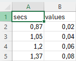

<!---TODO: [](https://joss.theoj.org/papers/456eaf591244858915ad8730dcbc19d7)
-->
[](https://joss.theoj.org/papers/fcfce9c9fb4d33c87dac8cf876fd3b27)
[](https://github.com/gouverneurp/eVAS/blob/main/LICENSE.MD)

# eVAS: A user-friendly electronic Visual Analogue Scale
<picture>
    
</picture>

This is the source code of the **e**lectronic **V**isual **A**nalogue **S**cale (**eVAS**).
It is an open source, easy to use and user-friendly slider that records the slider values and saves them to CSV files. The application is available for Windows, MacOS and Ubuntu ([information on how to use](https://github.com/gouverneurp/eVAS/tree/main?tab=readme-ov-file#standalone)).
The *config.ini* file can be edited to customise the **eVAS** to your needs. Examples of possible configurations can be found in the [examples](examples/) directory.
Possible errors are logged in a *log.txt* file.

<picture>
    <p align="center">
        
    </p>
</picture>

# Statement of need

<!---Self-reports -> VAS-->
Self-report measures are one of the most popular tools used to measure personality because of their practicality and extensive research support. In particular, VASs are used as simple tools to provide single index measures, with the majority of research using VASs focusing on obtaining health states. Examples include the measurement of pain, but also several other applications such as the estimation of hunger or emotions such as anxiety.
<!---need for VAS (pain) to automate-->
While paper-based solutions are easy to implement, they lack the continuity, scalability and automation that are of paramount importance in most areas of research. To overcome these problems, research could benefit from software that implements self-report scales. Electronic versions could help to automate data collection, allow continuous recording with accurate timestamps where reaction times are critical, and be used in large studies.
<!--- Use case: Can be used for automated pain recognition -> CoVAS is importance-->
For example, the inclusion of subjective perceived pain levels from a Computerised Visual Analogue Scale (CoVAS) in the construction of automated pain detection models has been shown to improve classification results.

<!--- While several works have proven that eVAS is valid - eVAS are not commonly applied-->
Although several papers have demonstrated that scores obtained from computer and mobile phone-based platforms and traditional paper-based VAS assessment are not interchangeable, but yield comparable results, electronic implementations of VASs are not commonly used.
<!--- eVAS are not freely accessible-->
More specifically, papers using electronic versions rarely share their software and open source code to implement solutions is rare.
<!--- Available solutions-->
In addition, research articles introducing electronic scales are outdated with broken download links, such as the Adaptive Visual Analog Scales (AVAS), or for specific use cases, such as the Visual Analog Scales Measuring State Anxiety (VAS-A).

<!--- Introduction our solution-->
Therefore, we present **eVAS**, an open source Python software to easily implement an electronic VAS.
It is available with built-in applications for all operating systems (Windows, Linux, MacOS), highly configurable and easy to use.
A detailed description of the introduced scale can be found in the following sections.

# How to use

## General information
**eVAS** is an easy-to-use visual analogue scale. Use the *config.ini* file to change the behaviour and appearance of the application. On startup, **eVAS** waits for a specific keystroke (space bar by default) to begin recording the visual analogue scale values continuously. Input can be configured for mouse and keyboard and is recorded at specific time intervals (frequency) or on value change. The application can be exited at any time by pressing Escape. The recorded data stream is automatically saved as a CSV file in the same directory as the application. An example recording may look as follows:



## Standalone
To use **eVAS** easily, you can download the latest version and run it without any further requirements. Just follow the instructions:
- Just visit the [download page](https://gouverneurp.github.io/evas.html) or the github page with the [latest releases](https://github.com/gouverneurp/eVAS/releases/latest/)
- Download the **eVAS** standalone software ('*eVAS.exe*' for Windows, '*eVAS_mac.zip*' for MacOS, and '*eVAS_ubuntu*' for Ubuntu)
- Launch the application
- (If you see a message like the one below from Windows Defender, run the software anyway by following these steps: )

First step                 |  Second step
:-------------------------:|:-------------------------:
<picture></picture>  |  <picture></picture>

- (On MacOS several additional steps are needed to run the application: follow the tutorials to [run](https://github.com/gouverneurp/eVAS/blob/main/tutorials/run_on_mac.md) and [give permissions](https://github.com/gouverneurp/eVAS/blob/main/tutorials/mac_not_trusted.md) for the application)

## Examples

**eVAS** is highly configurable. Simply specify the configuration file to suit your needs. Various use cases and configuration files can be found below:

Cold hot scale             |  Custom image scale
:-------------------------:|:-------------------------:
<picture><a href="eVAS/tree/main/examples/cold_hot_scale/"></a></picture>  |  <picture><a href="eVAS/tree/main/examples/custom_image_scale/"></a></picture>
**Default**                |  **Simplified faces pain scale**
<picture><a href="eVAS/tree/main/examples/default/"></a></picture>  |  <picture><a href="eVAS/tree/main/examples/simplified_faces_pain_scale/"></a></picture>
**Simple line**                |  **Numeric rating scale**
<picture><a href="eVAS/tree/main/examples/simple_line/"></a></picture>  |  <picture><a href="eVAS/tree/main/examples/numeric_rating_scale/"></a></picture>

To apply a specific configuration found here, simply click on the image, download all the files (a 'config.ini' file and any additional image files) and place them in the folder of your **eVAS** application (overwriting any old 'config.ini' files). Then simply start the application and enjoy the new configuration.
The adapted configurations listed can also be used as inspiration for other configurations.

## Python
If you want to run **eVAS** as a Python script in the command line, debug or contribute, please run the following commands:

- Clone the project
    ```bash 
    git clone https://github.com/gouverneurp/eVAS.git
    ```
- Install Python (tested with [Python 3.12](https://www.python.org/downloads/release/python-3120/))
- Create and activate a Python environment

    Windows:
    ```bash
    python -m venv venv
    .\venv\Scripts\activate
    ```
    Linux:
    ```bash
    python3 -m venv venv
    source venv/bin/activate
    ```
- Install the requirements
    ```bash 
    pip install -r requirements.txt
    ```

- Run **eVAS** via Python
    ```bash 
    python eVAS.py
    ```

- Optionally configure the *config.ini* to change the behaviour of the **eVAS**

# Build executables

If you want to build standalone executables based on your own custom code, please run the following script for your operating system. The scripts themselves use _pyinstaller_ internally. Cross-platform building is not supported, so if you want to build the Windows application, run it on Windows.

For Windows use the [create_vas_exe.ps1](scripts/create_vas_exe.ps1) script: 
```bash 
.\scripts\create_vas_exe.ps1
```

For Ubuntu use the [create_ubuntu_app.sh](scripts/create_ubuntu_app.sh) script:
```bash 
./scripts/create_ubuntu_app.sh
```

For MacOS use the [create_mac_app.sh](scripts/create_mac_app.sh) script:
```bash 
./scripts/create_mac_app.sh
```

# How to contribute to the software
All help is welcome and needed! Feel free to open pull requests and contact us via email at [philipgouverneur@gmx.de](mailto:philipgouverneur@gmx.de).

# Report issues or problems with the software
You are welcome to open issues here directly on GitHub, or contact us by email at [philipgouverneur@gmx.de](mailto:philipgouverneur@gmx.de).

# Known issues

- Pressing the Caps Lock key may cause the application to crash on certain versions of MacOS. This problem is known for eVAS and is strongly related to tkinter not working properly with pynput. The current solution is to avoid pressing the key on MacOS.

# Used resources
The application icon (<picture></picture>) is free to use and can be found at the following [link](https://de.freepik.com/icon/schlecht_10012613#fromView=search&term=pain+rating&page=1&position=16&track=ais).

<a href="https://de.freepik.com/icon/schlecht_10012613#fromView=search&term=pain+rating&page=1&position=16&track=ais">Created by Muhammad_Usman & Designed by Freepik</a> 
<!---TODO:
# Please cite our paper if you use our software or code:
```bibtex
@article{ TODO:
}
```
-->