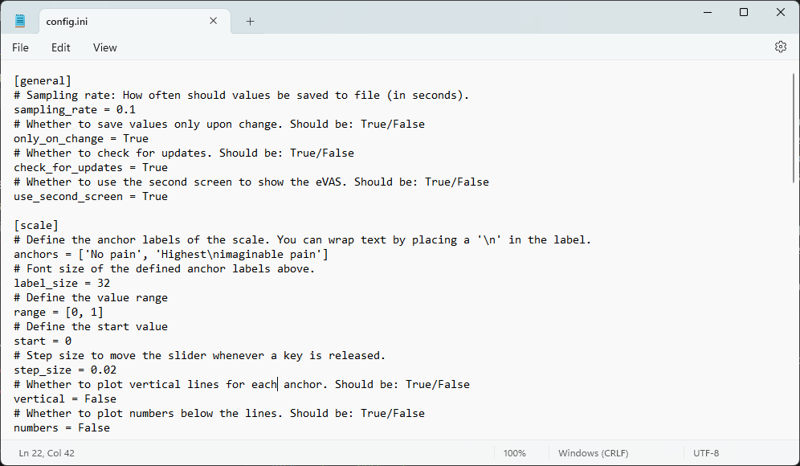
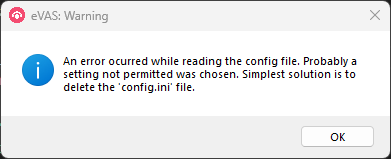

# Summary

<!---Short problem statement-->
Data collection is ubiquitous in many areas of research. Recently, more and more data collection has been automated to facilitate subsequent computer analysis. The same applies to access to subjects' interpretations in the form of self-reports. These self-reports, usually collected in paper form as questionnaires, are standard in several applications in the field of psychology, and have been used in studies of e.g., pain, emotion, behaviour, anxiety and personality assessment.
Ratings are often obtained using simple Visual Analogue Scales (VAS) or Numeric Rating Scales (NRS), where subjects are asked to rate a particular outcome on a straight line or by a number in a given range with specific anchors. For example, people are asked to rate their current perceived level of pain between the anchors 'no pain' and 'most pain imaginable'.
While these self-reports are easy to do with pen and paper, open-source software that can easily digitise and quantify the results of self-reports on an ongoing basis is rare. This scarcity of software solutions is a particular problem for researchers who are not familiar with writing code and software themselves.

<!---Description of the software, idea of open source and easy to use for non programmers-->
We therefore present the electronic Visual Analogue Scale (`eVAS`), an easy-to-use electronic visual analogue scale that continuously records subject feedback. Initially introduced to record pain levels for automated pain detection, but not limited to this use case, `eVAS` aims to provide a ready-to-use tool that is highly configurable, even for non-computer scientists, and can be used for various applications.
`eVAS` is open source, hosted on [GitHub](https://github.com/gouverneurp/eVAS), available from a [download page](https://gouverneurp.github.io/eVAS.html) and distributed under an MIT license. It employs automatic updates via GitHub when a new release is available, is working fail-safe, logs possible errors in a log file and saves results as text files.

# Statement of need

<!---Self-reports -> VAS-->
Self-report measures are one of the most popular tools used to measure personality because of their practicality and extensive research support [@robins2009handbook]. In particular, VASs are used as simple tools to provide single index measures, with the majority of research using VASs focusing on obtaining health states [@aastrom2023use]. Examples include the measurement of pain [@heller2016analyze], but also several other applications such as the estimation of hunger [@beaulieu2021psychobiology] or emotions such as fear (of childbirth) [@rouhe2009fear] or anxiety [@van2008validation].
<!---need for VAS (pain) to automate-->
While paper-based solutions are easy to implement, they lack the continuity, scalability and automation that are of paramount importance in most areas of research. To overcome these problems, research could benefit from software that implements self-report scales. Electronic versions could help to automate data collection, allow continuous recording with accurate timestamps where reaction times are critical, and be used in large studies.
<!--- Use case: Can be used for automated pain recognition -> CoVAS is importance-->
For example, the inclusion of subjective perceived pain levels from a Computerised Visual Analogue Scale (CoVAS) in the construction of automated pain detection models has been shown to improve classification results [@gouverneur2021classification; @gouverneur2021comparison].

<!--- While several works have proven that `eVAS` is valid - `eVAS` are not commonly applied-->
Although several papers have demonstrated that scores obtained from computer and mobile phone-based platforms and traditional paper-based VAS assessment are not interchangeable [@byrom2022measurement], but yield comparable results [@byrom2022measurement; @whybrow2006evaluation; @kos2017electronic; @delgado2018validation], electronic implementations of VASs are not commonly used.
<!--- `eVAS` are not freely accessible-->
More specifically, paper using electronic versions rarely share their software, such as @turnbull2020comparison, and open source code to implement solutions is rare.
<!--- Available solutions-->
In addition, research articles introducing electronic scales are outdated with broken download links, such as the Adaptive Visual Analog Scales (AVAS) [@marsh2009adaptive], or for specific use cases, such as the Visual Analog Scales Measuring State Anxiety (VAS-A) [@abend2014reliability].

<!--- Introduction our solution-->
Therefore, we present `eVAS`, an open source Python software to easily implement an electronic VAS.
It is available with built-in applications for all operating systems (Windows, Linux, MacOS), highly configurable and easy to use.
A detailed description of the introduced scale can be found in the following sections.

# Usage

<!--- General usage -->
The `eVAS` is designed to be as easy to use as possible, so that researchers without a background in computer science can use it.
Standalone applications for Windows, Linux and MacOS are available from the following [download page](https://gouverneurp.github.io/eVAS.html) or the github [release page](https://github.com/gouverneurp/eVAS/releases/latest/).
Simply download the appropriate software and double-click to run.
The software runs without any additional files or requirements as such. The default use of the application allows the user to exit the software at any time by pressing Escape. On startup, the software checks for updates, then loads the full screen application, displays the scale and instruction message, and waits for user interaction. A recording can be started by pressing the space bar. The slider can then be moved left/right according to the user's feedback. The values are saved to a file throughout the session. As mentioned earlier, the user can stop the current recording by pressing the Escape key.

<!--- Examples -->
A screenshot of a possible appearance of the `eVAS` for pain assessment can be seen in \autoref{fig:screenshot}.
Further examples are available at the following [link](https://github.com/gouverneurp/eVAS/tree/main/examples), where the given configuration files can be copied to apply the specific scale.

{ width=75% }

<!--- Configuration: config.ini --->
A text file ('config.ini') can be used to change the behaviour and appearance of the scale. Several parameters in the General, Scale, Devices, Keys, Appearance and CSV categories can be set directly in the text file. Each parameter has a short description that summarises its purpose and the changes that occur when it is modified. For example, keyboard or mouse control can be configured and even specific key mappings can be implemented. If no configuration file can be found, a default file is created at the start of the application, which implements a simple VAS for pain assessment. A screenshot of the beginning of the default configuration can be found in \autoref{fig:config}. A list of all parameters can be found in \autoref{parameters}.

{ width=75% }

<!--- Table with parameters -->
: Parameters of the _config.ini_ file\label{parameters}.

|  Section       |       Name               | Expected value    |           Default            | Description                                        |
| :------------: | :----------------------: | :---------------: | :--------------------------: | -------------------------------------------------- |
|  General   |   sampling_rate   |     float      |             0.1              | How often should values be saved to file (in seconds).                         |
|            |  only_on_change   |      bool      |             True             | Whether to save values only upon change.                                       |
|            | use_second_screen |      bool      |             True             | Whether to use the second screen to show the `eVAS`.                             |
|   scale    |      anchors      |      list      | `['No pain', 'High pain'\]`  | Anchor labels of the scale.                                                    |
|            |    label_size     |      int       |              32              | Font size of the defined anchor labels.                                        |
|            |       range       |      list      |           `[0,1]`            | List with two integers, defining the value range.                              |
|            |       start       |      int       |              0               | Defining the start position/value of the slider.                               |
|            |     step_size     |     float      |             0.2              | Step size to move the slider whenever a key is released.                       |
|            |     vertical      |      bool      |            False             | Whether to plot vertical lines for each anchor.                                |
|            |      numbers      |      bool      |            False             | Whether to plot numbers below the vertical lines.                              |
|  devices   | trigger_thermode  |      bool      |            False             | Whether to trigger the thermode (QST.LAB TCS2).                                |
|            |  move_while_down  |      bool      |            False             | Whether to move the slider while the button is held down.                      |
|            |     use_mouse     |      bool      |            False             | Whether to use the mouse (slider does not move with keys anymore).             |
|            |     on_click      |      bool      |            False             | Whether to update only on mouse click.                                         |
|    keys    |    keys_start     |      list      |        `[Key.space]`         | Keys to start the recording.                                                   |
|            |     keys_end      |      list      |     `[Key.esc, Key.end]`     | Keys to end the recording.                                                     |
|            |     keys_left     |      list      |  `[Key.left, Key.page_up]`   | Keys to move the slider left.                                                  |
|            |    keys_right     |      list      | `[Key.right, Key.page_down]` | Keys to move the slider right.                                                 |
| appearance |     use_image     |      bool      |            False             | Whether to load an external image as slider background.                        |
|            |  use_upper_image  |      bool      |            False             | Whether to load an external image and place it above the slider.               |
|            |   slider_width    |      int       |              31              | Width of the slider.                                                           |
|            |   slider_height   |      int       |             138              | Height of the slider.                                                          |
|            |   slider_color    |      list      |           (0,0,0)            | Color of the slider.                                                           |
|            |    left_color     |      list      |        (192,192,192)         | Background color left.                                                         |
|            |    right_color    |      list      |          (64,64,64)          | Background color right.                                                        |
|            |     mid_color     |   list/None    |             None             | Background color mid.                                                          |
|            |   use_triangle    |      bool      |            False             | Use a triangle instead of a square for the background.                         |
|            | use_two_triangle  |      bool      |            False             | Use a decreasing & increasing triangle instead of a square for the background. |
|            |  welcome_message  |     string     |                              | Welcome message that is displayed at the beginning.                            |
|            |    hide_slider    |      bool      |            False             | Whether to hide the slider until first user interaction.                       |
|    csv     |     delimiter     |     string     |              ;               | Delimiter used in the CSV output file.                                         |
|            |   decimal_point   |     string     |              ,               | Decimal point used in the CSV output file.                                     |
|            |  decimal_places   |      int       |              4               | Number of digits after the decimal point for the slider values saved.          |

<!--- CSV outcome --->
Measured feedback from the `eVAS` is stored in a CSV file for ease of use. The resulting files consist of two columns, 'secs' and 'values', containing an entry with the measurement and an associated timestamp in seconds.
The delimiter and floating point are set to the European standard, a semicolon and comma respectively, but can be changed in the configuration. In addition, the frequency and whether values should be saved only on change can also be set in the config.ini file. The timestamp in seconds is stored to two decimal places, while the values are freely configurable.
The resulting file names contain the start time in the format "year|month|day_hour|minute|second_vas.csv", for example "20240206_093809_vas.csv". If the application is closed without recording any data, the empty CSV file is deleted on exit.

<!--- Log file --->
Although `eVAS` has been implemented to catch errors, unexpected errors are logged in a log.txt file. If no error is logged, the empty log file will be removed at the end of the `eVAS` instance. Common errors, such as a corrupt config.ini file, are caught and useful information is provided to the end user via message boxes. A screenshot of an example warning displayed when the configuration file is incorrectly set up can be seen in \autoref{fig:config_warning}.

{ width=50% }

<!--- Update -->
To enable automatic deployment of new features and bug fixes, the software checks for new releases on GitHub at startup. If a new version is available, the user is notified and an automatic update can be performed (Windows only).

<!--- Github | PyInstaller -->
Researchers are welcome to contribute on GitHub, open pull requests, implement their own versions and deploy them using the provided scripts to build the executables using PyInstaller. The application and scripts have been implemented and tested using Python 3.12.

<!--- Creation & Target Group -->
The idea and first implementations of `eVAS` were realised in the course of the BMBF project _PainMonit_ ('Multimodale Plattform zum Schmerz-Monitoring in der Physiotherapie', 01DS19008A/B). Here, the task of building automated pain detection systems in the physiotherapy context showed a clear need for a digital yet easy-to-use tool. As we focused on providing a simple application that could be used by researchers of any background, we did not make the software available on the Python Package Index or related repositories. Knowledge of Python should not be a requirement for end users, so `eVAS` is available as standalone software running on Windows, MacOS and Ubuntu. Previous implementations of the software have been used to collect data for pain-related studies [@luebke2024differential; @szikszay2023psychological; @szikszay2022temporal].
<!--- Conclusion -->
By creating easy-to-use Python software, we hope that `eVAS` can help researchers to easily conduct their experiments and collect subjective feedback from subjects.

# Acknowledgements

This research was funded by the German Federal Ministry of Education and Research (BMBF) in the frame of the project PainMonit (grant number: 01DS19008B).

# References
